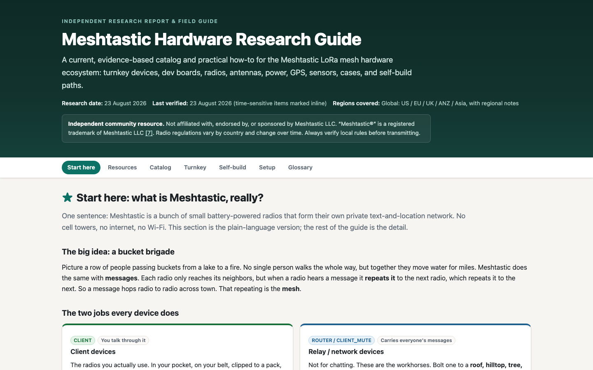

# Meshtastic Hardware Guide

An independent research guide for choosing Meshtastic devices, radios, antennas, power systems, GPS modules, sensors, cases, and self-build paths.



**[Open the live guide](https://mesh-guide.alicetech.io)**

## Why this exists

Comparing Meshtastic hardware usually means piecing together radio specifications, regional compatibility, power requirements, enclosure details, and community experience across many sources. This project organizes that research into one practical decision surface for both turnkey buyers and people assembling their own nodes.

## Research approach

The guide is original independent research built from manufacturer specifications, official Meshtastic documentation, and attributed community references. It is not affiliated with Meshtastic LLC. Product names and trademarks belong to their respective owners.

## Design constraints

- One self-contained `index.html`
- No framework, dependency install, or build step
- Works offline after download
- Responsive enough for field use on a phone
- Published through GitHub Pages with a custom subdomain

The single-file constraint keeps the guide easy to archive, share, inspect, and use when connectivity is unreliable.

## Run locally

```bash
python3 -m http.server 8000
```

Then open `http://localhost:8000`.

## Repository contents

- `index.html`: the complete research guide and application
- `docs/mesh-guide.png`: current project screenshot
- `CNAME`: GitHub Pages custom-domain record
